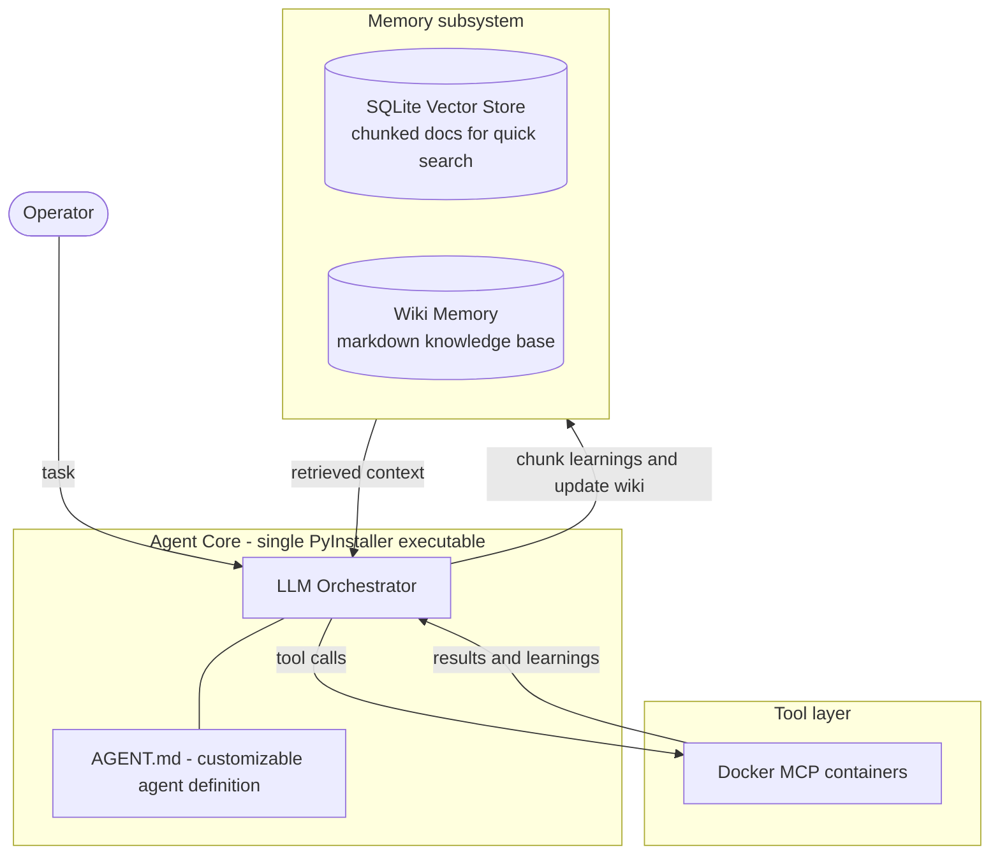

# DeCypherTek.ai

A customizable, self-learning AI agent built for penetration testing. It is taught to read the docs before it uses a tool, remember what it learns, run its tools in Docker MCP containers, and ship as one executable that can replicate itself.

*Decoding technology, so you don't have to.*

## Overview

DeCypherTek.ai is a docs-first agent framework for authorized security testing. The architecture is deliberately the simplest one that works — a heavier, earlier design was torn down and rebuilt around these ideas. Instead of a closed product, the system is customizable by design:

- Agent behavior is defined in customizable `AGENT.md` files.
- Memory lives in a local SQLite vector store plus a markdown Wiki Memory.
- Tools run as Docker MCP containers.
- The entire agent packages into a single PyInstaller executable, which also makes self-replication easy.

## Core Ideas

- **Pentest-first.** Previous agent builds proved the concept but were general purpose; this one is purpose-built for penetration-testing workflows.
- **SQLite vector store.** A vector is just a DB — it chunks information so docs can be searched quickly. Simple to build, no external database service required.
- **Hardcoded Wiki Memory.** Wiki Memory is markdown, so it is technically docs: curated baseline knowledge the agent ships with out of the box.
- **Teaching the LLM logic.** The agent is instructed: read the man pages first before using a tool, then chunk them into the vector store. When a tool call teaches it something new, chunk that again into the vector store and/or update Wiki Memory.
- **Docker MCP tools.** Tools are MCP (Model Context Protocol) servers running in Docker containers.
- **Customizable agents.** Build custom agents whose `AGENT.md` can be customized per use case, without touching code.
- **Single PyInstaller executable.** An all-in-one binary — and the mechanism that makes self-replication easy.
- **Termux / mobile.** A goal: a build that runs on a phone via Termux.

## Architecture

### Components

| Component | Role |
| --- | --- |
| **LLM Orchestrator** | Planning, reasoning, and driving the loop below. |
| **`AGENT.md`** | Customizable per-agent definition; behavior without code. |
| **SQLite Vector Store** | Chunked docs for fast semantic search. |
| **Wiki Memory** | Markdown knowledge base; hardcoded baseline, updated as the agent learns. |
| **Docker MCP containers** | Isolated tool execution over the Model Context Protocol. |
| **PyInstaller binary** | All-in-one packaging; the self-replication vehicle. |

### Learning Loop

1. **Before a tool call** — the agent reads the tool's docs (man pages first) for what it is about to use and chunks them into the vector store.
2. **Call the tool** — execution happens inside its Docker MCP container.
3. **After the tool call** — chunk what was learned into the vector store and/or update Wiki Memory.
4. **Next run starts smarter** — knowledge is recalled from memory instead of relearned from scratch.

## Roadmap

- [ ] Finalize this architecture and harden it for security
- [ ] Build the SQLite vector store and hardcoded Wiki Memory (~1 week of effort)
- [ ] Implement the docs-first learning loop
- [ ] Integrate Docker MCP tool containers
- [ ] Support customizable agents via `AGENT.md`
- [ ] Package a single PyInstaller executable with self-replication
- [ ] Termux build for mobile

## Responsible Use

This project is intended for authorized penetration testing and security research only. Only test systems you own or have explicit written permission to test.
