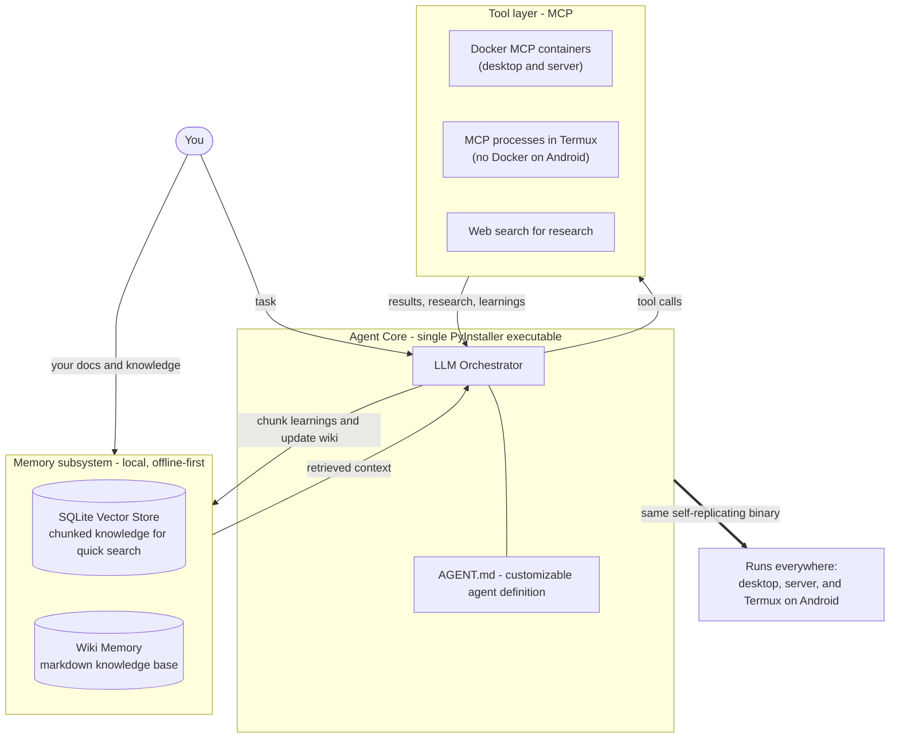

# DeCypherTek.ai

A customizable, self-learning AI agent. It is taught to read the docs before it uses a tool, remember what it learns, search the web to do research, run its tools over MCP, and ship as one PyInstaller executable that runs anywhere — including Termux on Android.

*Decoding technology, so you don't have to.*

## Overview

DeCypherTek.ai is a customizable agent framework that can be used for anything — the behavior, knowledge, and tools are yours to define. The agent has access to the technical knowledge and docs you provide, can search the web to do research, and carries a real memory: Wiki Memory together with a Vector DB lets the LLM learn, remember, and hold custom knowledge, so it gets smarter with every run.

The whole thing is one PyInstaller executable — the same binary runs on your desktop, your server, and your phone in Termux. The architecture is deliberately the simplest one that works:

- Agent behavior is defined in customizable `AGENT.md` files.
- Memory lives in a local SQLite vector store plus a markdown Wiki Memory — no external database to stand up, which is exactly what lets a phone run it.
- Knowledge is custom: you provide the docs and technical knowledge it works from.
- Tools speak MCP — in Docker containers on desktop and server, as local processes under Termux on Android.
- Web search is built in for research.
- One binary for every platform, which also makes self-replication easy.

## Core Ideas

- **Customizable.** It can be used for anything. Behavior comes from a customizable `AGENT.md`, knowledge comes from the docs you provide, and tools come from MCP servers — swap any of them and it is a different agent.
- **Memory.** Wiki Memory and a Vector DB give the LLM a real memory — it can learn, retain what it learns, and carry custom knowledge across runs.
- **Custom knowledge.** The agent has access to the technical knowledge and docs you provide, chunked into memory, so it works on your stack and in your domain.
- **SQLite vector store.** A vector is just a DB — it chunks knowledge so docs can be searched quickly. Simple to build, no external database service required.
- **Hardcoded Wiki Memory.** Wiki Memory is markdown, so it is technically docs: curated baseline knowledge the agent ships with out of the box, and a place to write what it learns.
- **Teaching the LLM logic.** The agent is instructed: read the docs (man pages first) before using a tool, then chunk them into the vector store. When a tool call teaches it something new, chunk that again into the vector store and/or update Wiki Memory.
- **Web research.** When memory and local docs are not enough, the agent can search the web to do research — and chunk what it finds into memory.
- **MCP tools.** Tools are MCP (Model Context Protocol) servers — Docker containers on desktop and server, local processes under Termux on Android.
- **One PyInstaller executable.** Everything — the agent, its memory engine, the bundled baseline docs — packages into a single onefile binary, and that is also what makes self-replication easy.
- **Termux / Android.** A first-class target: the exact same binary runs in Termux on a phone. No Docker and no external services required on-device.

## Architecture

### Components

| Component | Role |
| --- | --- |
| **LLM Orchestrator** | Planning, reasoning, and driving the loop below. |
| **`AGENT.md`** | Customizable per-agent definition; behavior without code. |
| **SQLite Vector Store** | Chunked knowledge for fast semantic search. |
| **Wiki Memory** | Markdown knowledge base; hardcoded baseline plus everything the agent writes back. |
| **Your docs** | Technical knowledge and docs you provide, chunked into memory. |
| **Web search** | Online research; findings get chunked into memory. |
| **MCP tool servers** | Tools over the Model Context Protocol — Docker containers on desktop and server, local processes under Termux. |
| **PyInstaller binary** | One executable for desktop, server, and Android (Termux); the self-replication vehicle. |

### How It Learns

1. **Before a tool call** — the agent reads the docs for what it is about to use (man pages first) and chunks them into the vector store.
2. **Research** — when memory and local docs don't hold the answer, it searches the web and chunks the findings into memory.
3. **Call the tool** — execution happens through its MCP tool server: containerized on desktop and server, a local process in Termux.
4. **After the tool call** — chunk what was learned into the vector store and/or update Wiki Memory.
5. **Next run starts smarter** — knowledge is recalled from memory instead of relearned from scratch.

## Termux on Android

The phone is a first-class platform, not an afterthought. Everything is just one PyInstaller executable, and it runs in Termux:

- **Nothing to install but Termux.** The agent, its memory engine, and the bundled baseline docs are a single onefile binary built for aarch64. Install Termux, drop the binary in, and run — no Python toolchain, no pip installs, no Docker.
- **Local-first memory.** No external database or hosted service is required — the SQLite vector store and Wiki Memory are just files in the agent's data directory on the phone. That is the whole reason the memory design stays this simple: it has to run on a phone.
- **Tools over MCP, not Docker.** Docker does not exist on Android, so MCP tool servers run as local processes inside Termux — the same servers run containerized on desktop and server.
- **Research in your pocket.** Web search gives the phone everything it does not already carry; the findings get chunked into memory for next time.
- **Self-replication is a file copy.** The agent is literally one executable, so replicating it means copying it — phone to phone, or laptop to phone.

## Roadmap

- [ ] Build the SQLite vector store and hardcoded Wiki Memory (~1 week of effort)
- [ ] Implement the docs-first learning loop
- [ ] Add web search for research
- [ ] Integrate MCP tool servers — Docker on desktop and server, local processes under Termux
- [ ] Support customizable agents via `AGENT.md`
- [ ] Package the single PyInstaller executable for desktop, server, and Termux (aarch64)
- [ ] Prove it end to end in Termux on Android: drop in the binary, learn a tool, self-replicate
