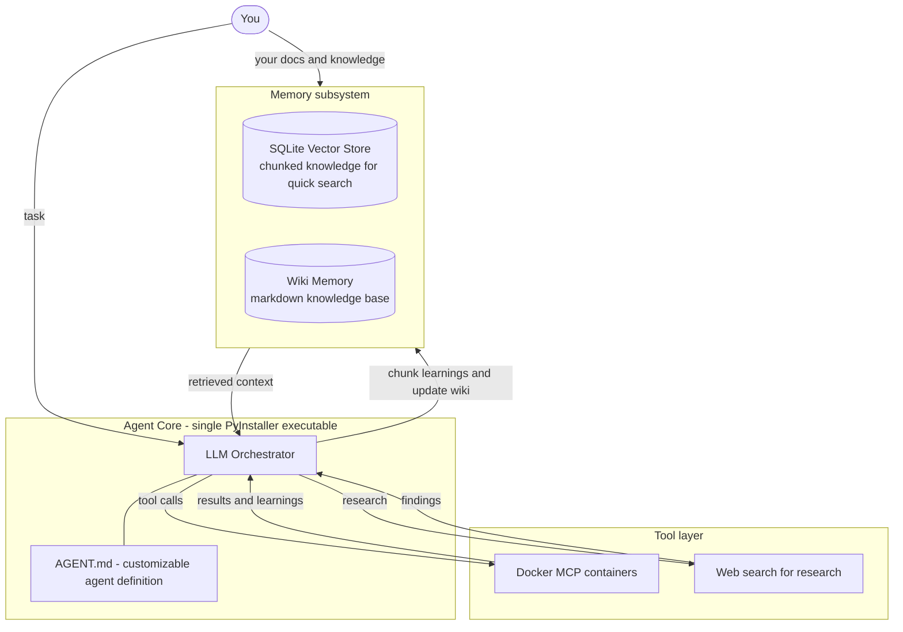

# DeCypherTek.ai

A customizable, self-learning AI agent. It is taught to read the docs before it uses a tool, remember what it learns, search the web to do research, run its tools in Docker MCP containers, and ship as one executable that can replicate itself.

*Decoding technology, so you don't have to.*

## Overview

DeCypherTek.ai is a customizable agent framework that can be used for anything — the behavior, knowledge, and tools are yours to define. The agent has access to the technical knowledge and docs you provide, can search the web to do research, and carries a real memory: Wiki Memory together with a Vector DB lets the LLM learn, remember, and hold custom knowledge, so it gets smarter with every run.

The architecture is deliberately the simplest one that works — a heavier, earlier design was torn down and rebuilt around these ideas:

- Agent behavior is defined in customizable `AGENT.md` files.
- Memory lives in a local SQLite vector store plus a markdown Wiki Memory.
- Knowledge is custom: you provide the docs and technical knowledge it works from.
- Tools run as Docker MCP containers, and web search is built in for research.
- The entire agent packages into a single PyInstaller executable, which also makes self-replication easy.

## Core Ideas

- **Customizable.** It can be used for anything. Behavior comes from a customizable `AGENT.md`, knowledge comes from the docs you provide, and tools come from Docker MCP containers — swap any of them and it is a different agent.
- **Memory.** Wiki Memory and a Vector DB give the LLM a real memory — it can learn, retain what it learns, and carry custom knowledge across runs.
- **Custom knowledge.** The agent has access to the technical knowledge and docs you provide, chunked into memory, so it works on your stack and in your domain.
- **SQLite vector store.** A vector is just a DB — it chunks knowledge so docs can be searched quickly. Simple to build, no external database service required.
- **Hardcoded Wiki Memory.** Wiki Memory is markdown, so it is technically docs: curated baseline knowledge the agent ships with out of the box, and a place to write what it learns.
- **Teaching the LLM logic.** The agent is instructed: read the docs (man pages first) before using a tool, then chunk them into the vector store. When a tool call teaches it something new, chunk that again into the vector store and/or update Wiki Memory.
- **Web research.** When memory and local docs are not enough, the agent can search the web to do research — and chunk what it finds into memory.
- **Docker MCP tools.** Tools are MCP (Model Context Protocol) servers running in Docker containers.
- **Single PyInstaller executable.** An all-in-one binary — and the mechanism that makes self-replication easy.
- **Termux / mobile.** A goal: a build that runs on a phone via Termux.

## Architecture

### Components

| Component | Role |
| --- | --- |
| **LLM Orchestrator** | Planning, reasoning, and driving the loop below. |
| **`AGENT.md`** | Customizable per-agent definition; behavior without code. |
| **SQLite Vector Store** | Chunked knowledge for fast semantic search. |
| **Wiki Memory** | Markdown knowledge base; hardcoded baseline plus everything the agent writes back. |
| **Your docs** | Technical knowledge and docs you provide, chunked into memory. |
| **Web search** | Online research; findings get chunked into memory. |
| **Docker MCP containers** | Isolated tool execution over the Model Context Protocol. |
| **PyInstaller binary** | All-in-one packaging; the self-replication vehicle. |

### How It Learns

1. **Before a tool call** — the agent reads the docs for what it is about to use (man pages first) and chunks them into the vector store.
2. **Research** — when memory and local docs don't hold the answer, it searches the web and chunks the findings into memory.
3. **Call the tool** — execution happens inside its Docker MCP container.
4. **After the tool call** — chunk what was learned into the vector store and/or update Wiki Memory.
5. **Next run starts smarter** — knowledge is recalled from memory instead of relearned from scratch.

## Roadmap

- [ ] Build the SQLite vector store and hardcoded Wiki Memory (~1 week of effort)
- [ ] Implement the docs-first learning loop
- [ ] Add web search for research
- [ ] Integrate Docker MCP tool containers
- [ ] Support customizable agents via `AGENT.md`
- [ ] Package a single PyInstaller executable with self-replication
- [ ] Termux build for mobile
